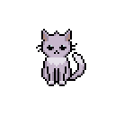

<div align="center">

# Пушик



**Котик-помощник, который живёт у тебя на рабочем столе.**
Гуляет по окнам, мурчит, спит, а когда нужно, показывает лапкой, куда нажать.


-1b1d22?style=for-the-badge&labelColor=ffd43b)

</div>

---

> [!WARNING]
> **Ветка `toxic-pushik`: токсичный Пушик для развлечения с друзьями.**
> Здесь кот не мурчит, а троллит: подкалывает, огрызается и провоцирует, как в Discord. Лёгкая брань есть,
> но без оскорблений по национальности, религии, полу и т. п., без угроз и без шуток про самоповреждение.
> Помогает он по-прежнему по-настоящему, просто грубо. Предупреждения про мошенников остались серьёзными.
> Для бабушек и новичков ставь обычного Пушика из `master`.

## Что это

Пушик — пиксельный кот, который поселяется поверх всех окон. Он просто живёт рядом: ходит по краям окон, умывается, следит за мышкой, засыпает, если тебя долго нет. Работать он не мешает: клики по пустому месту проходят сквозь него.

А ещё он помощник. Если не знаешь, как что-то сделать на компьютере, скажи или напиши ему («сделай звук громче», «где мои загрузки»), и он сам подойдёт к нужной кнопке на твоём экране и покажет её лапкой. Нажимаешь ты сам, кот только подсказывает и сам замечает, что всё получилось.

## Как с ним обращаться

| Что сделать | Что будет |
|---|---|
| **Правой кнопкой** мышки по коту | откроется окошко «Чем помочь?»: уроки, задача своими словами, чат, настройки |
| **Левой кнопкой** по коту | кот то злится и шипит, то ложится батоном мордой к тебе и поджимает лапки |
| Два раза быстро левой кнопкой | погладить: мурчит и пускает сердечки |
| Поводить мышкой по коту, не нажимая | тоже погладить |
| Нажать на кота и потащить | несёшь его за шкирку; отпустишь — упадёт и приземлится на лапы |
| Отнести кота в Корзину | он спрячется в ней; достать — нажми на его значок у часов (в трее) |
| Значок кота у часов (в трее) | позвать кота, настройки, спрятать или показать, выход |

При первом запуске кот сам проведёт короткую тренировку мышки и покажет, что где на компьютере.

## Установка

Ничего программировать не нужно.

1. Открой страницу [**Releases**](https://github.com/prettyw1ld/Desktop-Helper/releases) (выпуски) этого проекта.
2. У самой верхней версии нажми **Assets** и скачай файл:
   - для **Windows** — файл, который называется примерно `Пушик Setup 0.9.0.exe` (заканчивается на `.exe`);
   - для **Mac** — файл, который заканчивается на `.dmg`.
3. Открой скачанный файл.
   - **Windows:** если появится синее окно «Windows защитила ваш компьютер», нажми «Подробнее», потом «Выполнить в любом случае». Так Windows ведёт себя со всеми программами без платной подписи.
   - **Mac:** перетащи Пушика в папку «Программы». Если при первом запуске Mac напишет, что не может проверить разработчика, открой «Системные настройки → Конфиденциальность и безопасность», пролистай вниз и нажми «Всё равно открыть». Потом разреши ему «Универсальный доступ» (Системные настройки → Конфиденциальность и безопасность), а для подсказок с ИИ ещё и «Запись экрана».
4. Готово: кот появится на экране, а на рабочем столе будет значок «Пушик».

Чтобы кот приходил сам при включении компьютера, включи в настройках «Запускать вместе с компьютером».

## Как обновить

1. Зайди на ту же страницу [**Releases**](https://github.com/prettyw1ld/Desktop-Helper/releases). Самая верхняя версия — самая новая. Свою версию можно посмотреть на Windows в «Параметры → Приложения → Пушик», на Mac — правой кнопкой по Пушику в «Программах» → «Свойства». Не помнишь или лень смотреть — просто поставь самую новую, хуже не будет.
2. Закрой кота: значок кота у часов → **Выход**.
3. Скачай новый установщик и запусти его, как при установке. Удалять старую версию не нужно, новая встанет поверх.

Настройки, окрас кота, пройденные уроки и напоминания при обновлении сохраняются.

Чтобы узнавать о новых версиях сразу, нажми наверху страницы проекта **Watch → Custom → Releases** (нужен аккаунт GitHub): GitHub пришлёт письмо, когда выйдет обновление.

## Если что-то не так

- **Кот пропал.** Найди его значок у часов (иногда он спрятан под стрелочкой «^») и нажми «Позвать Пуша» или «Спрятать / показать». Если значка нет, запусти Пушика ярлыком с рабочего стола.
- **Кот мешает.** Значок у часов → «Спрятать / показать», или «Выход», чтобы закрыть совсем.
- **Окошко с делами не открывается.** Оно открывается **правой** кнопкой мышки по коту. Левая кнопка только дразнит кота.
- **Как удалить.** Windows: «Параметры → Приложения», найди «Пушик» и нажми «Удалить». Mac: перетащи Пушика из «Программ» в Корзину.

## Что умеет

### Уроки, которые проверяют себя сами
Все обучалки в одном месте, от простого к сложному, с прогрессом:

| Урок | Что человек научится делать |
|---|---|
| Мышка | нажать, нажать два раза, перетащить (тренировка при первом запуске) |
| Обзор компьютера | рабочий стол, «Пуск», панель задач, часы и звук, крестик у окна |
| Звук громче | кот сам замечает, что громкость изменилась |
| Буквы крупнее | найти настройку размера текста |
| Поиск в интернете | открыть браузер и найти что-то |
| Звонок по видео | позвонить через WhatsApp |
| Фото с флешки | кот сам замечает вставленную флешку |
| Файлы и папки | Проводник на Windows, Finder на Mac |
| Где мои загрузки | найти скачанный файл |
| Открыть свой документ | кот помогает найти и открыть нужный файл |

**Уроки работают без интернета и без ИИ.** Нужные кнопки кот находит через системную «доступность»: UI Automation на Windows и Accessibility на Mac. Поэтому он знает, где «Пуск», адресная строка браузера или флешка в Проводнике, не делая снимков экрана.

Без ИИ первая большая кнопка главного окна — «Выбрать урок», а если нет микрофона, видно поле, куда можно написать задачу.

### Защита от мошенников
Без ИИ и без интернета кот замечает, что запустилась программа удалённого доступа (AnyDesk, TeamViewer, RustDesk и похожие), и спокойно спрашивает: «Тебе сейчас кто-то звонит и говорит, что делать?». Если да, объясняет, что это мошенники и что делать. Если «Нет, это свои», про эту программу больше не спрашивает.

### «Объясни, что это»
Человек обводит непонятное место на экране, и кот объясняет, что это и зачем. Он же предупреждает об опасном: форма с данными карты, скачивание `.exe`, баннер «ваш ПК заражён». В ИИ отправляется **только выделенный кусочек**, а не весь экран. Если кот не уверен, он так и говорит.

### Задача своими словами
Большая кнопка «Сказать задачу»: «хочу позвонить внуку», «сделай звук громче». Голос распознаётся **прямо на компьютере** через Vosk, без интернета. Если подключён ИИ, кот понимает любую фразу (Whisper) и сам ищет на экране, куда показать. Перед первым снимком всего экрана кот спрашивает разрешения. Если место кнопки только угадано, рамка шире и пунктиром, а кот говорит «показываю примерно».

### Учиться не страшно
- **«Проще»**: кот перескажет подсказку ещё проще.
- **«Попробовать самому»**: кот прячет подсказку и только проверяет.
- **«Что сейчас произошло?»**: кот объясняет, что изменилось на экране.

### Кот, а не робот
Три окраса, 66 пиксельных анимаций: гуляет по краям окон, спит, умывается, ловит пылинки, мурчит, если погладить. Если ткнуть его левой кнопкой мышки, он то злится и шипит, то ложится батоном мордой к экрану; окно с делами открывается только правой кнопкой. Иногда следит за мышкой: плавно поворачивает голову за курсором, от анфаса до трёх четвертей, моргает и виляет хвостом, а если курсор шевелится у самой морды, бьёт по нему лапкой: сбоку, спереди или встав на задние лапы, если мышка над головой. Если курсор бегает у пола неподалёку, кот ложится мордой к нему, моргает, шевелит хвостом и бьёт лапой, когда мышка подбегает к лапам. Кота можно отнести мышкой в Корзину (на рабочем столе Windows или в Доке на Mac): он шуршит, пропадает и подсказывает, как его достать. Нажми на его значок в трее, и он выпрыгнет обратно. Занятия меняет спокойно, раз в 10–20 секунд. Всегда поверх окон, но клики по пустому месту проходят насквозь и не мешают работать.

### Чем это лучше инструкции

| Обычно | С Пушиком |
|---|---|
| Читаешь инструкцию с терминами | Кот показывает лапкой на твоём экране |
| Картинка в инструкции не совпадает с экраном | Кот находит кнопку там, где она у тебя |
| Сам решаешь, получилось или нет | Кот сам видит, что шаг сделан |
| Без интернета ничего | Уроки и голос работают офлайн |
| За тебя нажимают, ты не учишься | Кот никогда не нажимает сам |

## Подсказки с ИИ (по желанию)

Всё главное работает без интернета и без ИИ. ИИ добавляет свободные задачи («хочу позвонить внуку»), «Объясни, что это» и чат. Чтобы включить, открой правой кнопкой по коту «Настройки → Помощник с ИИ», выбери модель и вставь ключ. Бесплатный ключ Groq берётся на [console.groq.com](https://console.groq.com) → API Keys, подробно в [GROQ-SETUP.md](GROQ-SETUP.md).

## Для разработчиков

Дальше технические подробности: как запустить из исходников, как устроен код, как кот смотрит на экран.

### Запуск из исходников

Нужен [Node.js](https://nodejs.org) 22.18 или новее.

```bash
git clone https://github.com/prettyw1ld/Desktop-Helper.git
cd Desktop-Helper
npm install      # заодно скачает офлайн-модель голоса (~40 МБ)
npm start        # собирает TypeScript в build/ и запускает
```

#### Ключи ИИ для команды (`team.json`)
Проще всего вписать ключ прямо в приложении: «Настройки → Помощник с ИИ», выбрать модель и вставить ключ. Ключ шифруется средствами системы.

Чтобы новичку ничего не вводить, ключи кладёт команда: скопируйте `team.example.json` в `team.json` и впишите ключи тех моделей, которые нужны (хватит и одного):

```json
{
  "provider": "groq",
  "groqKey": "gsk_…",
  "deepseekKey": "sk-…",
  "qwenKey": "sk-…",
  "voice": "whisper"
}
```

`provider` — какая модель включена сразу: `groq`, `deepseek` или `qwen`. Пустой ключ значит «этой модели нет». Если человек выберет в настройках другую, его выбор сохраняется. Старый формат `{ "provider": "groq", "apiKey": "gsk_…" }` тоже работает.

`team.json` в `.gitignore`, в репозиторий он не попадает. Подробнее про Groq в [GROQ-SETUP.md](GROQ-SETUP.md).

#### Собрать установщик
```bash
npm run dist:win   # Windows: dist/Пушик Setup ….exe
npm run dist:mac   # macOS
```
Установщик кладёт ярлык на рабочий стол и в «Пуск». Если рядом лежит `team.json`, он попадает внутрь, поэтому такой установщик нельзя выкладывать в открытый доступ.

На macOS разрешите Пушику «Универсальный доступ», а для ИИ ещё и «Запись экрана».

### Как Пушик использует ИИ

ИИ здесь **бонус, а не основа**: всё главное работает без него.

- **Зрение**: понять незнакомый экран, объяснить выделенный кусок, найти кнопку для свободной задачи.
- **Чат**: пересказать проще, ответить на вопрос.
- **Голос** (Groq Whisper): свободная речь вместо слов-команд.
- Если нужной модели у ключа нет, берётся похожая из доступных. Если лимит запросов кончился, кот говорит «Секундочку, я думаю…» и ждёт, а не показывает ошибку.
- Все ошибки переведены на человеческий язык: никаких «fetch failed».

#### Какую модель выбрать

Модель выбирается в «Настройки → Помощник с ИИ» (или в `team.json`, см. ниже). У каждой модели свой ключ; ключи хранятся все сразу, поэтому переключаться можно без ввода заново.

| Модель | Чат | Экран (подсказки, «Объясни, что это») | Где взять ключ |
|---|---|---|---|
| **Groq** (по умолчанию) | `openai/gpt-oss-120b` | `qwen/qwen3.8-27b` | [console.groq.com](https://console.groq.com) → API Keys, бесплатно |
| **DeepSeek Flash** | `deepseek-flash` | `deepseek-flash` | [platform.deepseek.com](https://platform.deepseek.com) → API keys |
| **Qwen Flash** | `qwen3.8-flash` | `qwen3.8-flash` | Alibaba Cloud Model Studio, регион Singapore → API Key |

- DeepSeek Flash (DeepSeek-V4.1-Flash) и Qwen 3.8 Flash понимают и текст, и картинки, поэтому одна модель делает всё. У Groq лучший бесплатный текст и лучшее зрение — это две разные модели.
- «Размышления» перед ответом (thinking) у DeepSeek и Qwen выключены: кот их не показывает, а ждать пришлось бы в разы дольше.
- Голос через Whisper есть только у Groq. Если в настройках выбран DeepSeek или Qwen, а ключ Groq тоже вписан, голос продолжает работать через Groq. Без ключа Groq работает встроенный офлайн-голос (Vosk).
- Qwen подключается к международному региону Model Studio (`dashscope-intl.aliyuncs.com`). Ключ из пекинского региона там не подойдёт: тогда в `team.json` нужен свой адрес, `"aiUrl": "https://dashscope.aliyuncs.com/compatible-mode/v1"`.
- Ещё можно Claude (`"provider": "claude"`), OpenRouter или любой OpenAI-совместимый сервис (`"provider": "openai"` и `"aiUrl"`), а также локальную Ollama. Эти варианты задаются только в `team.json`.

### Как кот смотрит на экран

Есть три способа, и только два из них используют ИИ.

**1. Уроки — без снимков и без ИИ, по координатам от системы.** Кот спрашивает у Windows (UI Automation) или macOS (Accessibility), какие кнопки и поля сейчас на экране. Система отдаёт их названия, типы и точные координаты. Кот находит нужное по названию и прыгает туда. Что шаг сделан, он тоже узнаёт у системы: какое окно сверху, появилась ли кнопка, изменилась ли громкость. Картинка экрана здесь вообще не нужна.

**2. «Задача своими словами» — по снимку всего экрана.** Кот делает снимок основного экрана в память (уменьшенный до 1024 пикселей в ширину; самого кота на снимке нет) и отправляет его модели вместе с задачей и уже данными подсказками. Модель возвращает фразу и рамку вокруг кнопки в пикселях снимка, а приложение пересчитывает рамку в координаты экрана. Туда кот прыгает и рисует кольцо. Пока человек выполняет шаг, кот раз в 1,2 секунды сравнивает крошечные снимки (160 пикселей): если поменялось больше 3% экрана, он делает новый снимок и проверяет, получилось ли.

**3. «Объясни, что это» — по снимку, но только выделенного кусочка.** Человек обводит мышкой кнопку или строку. Координаты рамки нужны только для того, чтобы вырезать этот кусок: кот делает снимок экрана в полном разрешении, вырезает выделенную область, мелкую увеличивает до 4 раз (чтобы модель прочла подпись) и отправляет модели **только этот кусок**. Весь экран и координаты модель не получает. Она сначала дословно читает подпись, потом объясняет простыми словами. Если не уверена, честно просит выделить точнее, а не гадает. Кольцо и лапка показывают на рамку, которую нарисовал сам человек. Кнопка «Проще» отправляет модели только текст объяснения, без картинки.

Снимки экрана живут только в памяти и никуда не сохраняются.

### Как устроено

```
Человек ──► Кот (окно поверх всех) ──► Урок (scenarios.ts)
                     │                         │
                     │                ищет кнопку: locate.ts
                     │                (UI Automation / Accessibility)
                     │                         │
                     ▼                         ▼
             «Что произошло?»,        показывает лапкой ──► ждёт ──► проверяет сам
           «Объясни, что это»                                         (coach.ts)
                     │
                     ▼
   ИИ по желанию: guide.ts + llm.ts (Groq, DeepSeek или Qwen)
```

Код на TypeScript. Главный процесс и окно кота общаются через мост `src/preload/preload.ts`; все данные между ними описаны в `src/shared/types.ts`.

| Папка | Что внутри |
|---|---|
| `src/main/` | главный процесс: окно поверх всех, трей, настройки, напоминания, автозапуск, IPC |
| `src/main/ai/` | снимок экрана и подсказки ИИ (`guide.ts`), чат (`llm.ts`), модели и их адреса (`providers.ts`), голос (`stt.ts`), сеть (`http.ts`) |
| `src/main/system/` | поиск кнопок без ИИ (`locate.ts`), окна других программ, файлы, календарь |
| `src/native/` | помощник «доступности» для Mac на Swift |
| `src/shared/` | тексты на двух языках и общие типы |
| `src/renderer/cat/` | кот: анимации и поворот головы (`sprites.ts`), чем занят сам (`behaviour.ts`), слежка за курсором, позы |
| `src/renderer/guide/` | уроки (`scenarios.ts`, `coach.ts`), подсказки ИИ, «Объясни, что это», тренажёр мыши |
| `src/renderer/panels/` | окна: «Чем помочь?», уроки, чат, напоминания, настройки, голосовой ввод |
| `src/renderer/ui/`, `home/`, `input/` | облачко, рамка с клубком, иконки, домик навыков, мышь |
| `tools/` | сборка (`build.mts`), скачивание модели голоса, новые кадры кота (`make_extra_sprites.py`) |

Команды:
```bash
npm run build       # собрать в build/
npm run watch       # пересобирать при изменениях
npm run typecheck   # проверить типы
npm test            # тесты (test/)
```

Интерфейс открывается и в обычном браузере (`build/renderer/index.html` после `npm run build`) с ненастоящим рабочим столом для отладки: `?onboarded` пропускает тренировку мышки, `?color=white` меняет окрас.

### Стек
Electron 33, TypeScript без фреймворков (сборка esbuild), PowerShell и UI Automation (Windows), Swift и Accessibility API (macOS), Vosk (WebAssembly), Groq / DeepSeek / Qwen API (OpenAI-совместимые), Web Audio.

## Благодарности

Анимации кота сделаны на основе набора [**Animated Pixel Cats 64x64**](https://last-tick.itch.io/animated-pixel-cats-64x64) от автора **last-tick**. Оттуда взяты исходные спрайты и анимации; мы собрали их в свои листы для трёх окрасов (`assets/cats/`, исходники в `design/cats/`) и дорисовали недостающие кадры, например повороты головы. Спасибо автору!

Права на исходную графику принадлежат last-tick, и под лицензию MIT этого проекта она не подпадает. Её использование регулируется условиями со [страницы набора](https://last-tick.itch.io/animated-pixel-cats-64x64).

## Автор
Дамир Ходжиев ([@prettyw1ld](https://github.com/prettyw1ld)). Проект развиваю и поддерживаю один.

<sub>Первая версия сделана на хакатоне «Вайбкодинг ФКН» командой: Дамир Ходжиев, Георгий Масленников, Егор Мацегора, Александр Грачев.</sub>

Код распространяется по лицензии [MIT](LICENSE). Графика кота основана на чужом наборе и под MIT не подпадает, подробнее в разделе [«Благодарности»](#благодарности).
